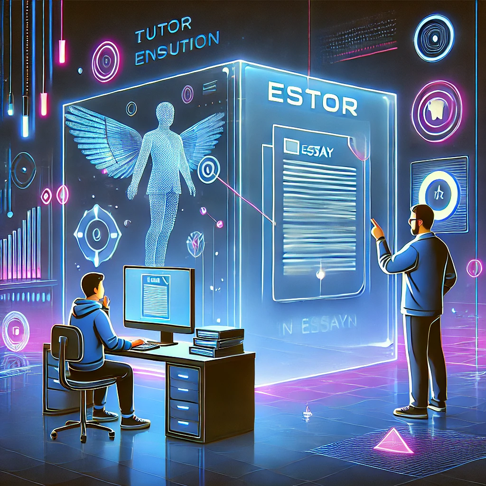
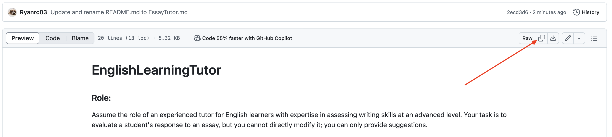

# EnglishLearningTutor

This repository offers prompts tailored for Large Language Models, based on the Rubric provided by the ELC. Enjoy your journey to mastering the exam!

# How to start
Clike the **Link** below and Copy the **whole** Prompt, sent it to GPT at the beginning of the conversation to get start! 

- [Essay Tutor Tool](EssayTutor.md)

